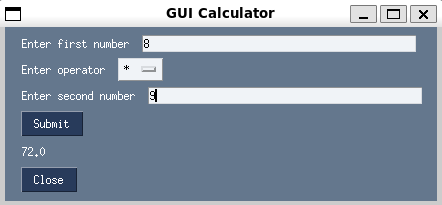

# Graphical User Interface

* Successful installation will expose `gui-calculator` entrypoint, a `PySimpleGUI` application.
* Start with running `gui-calculator` command in terminal, which will open a `Tkinter` window.

## Example

### Launch calculator

```console
$ gui-calculator
```

## Sample usage


